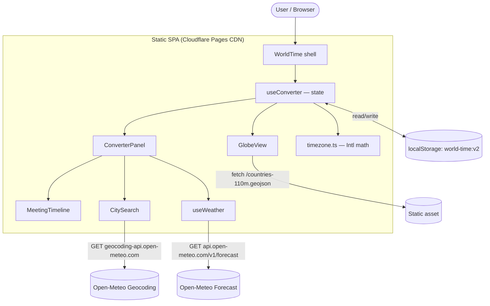

# ARCHITECTURE.md

> Authoritative reference for the **world-time** codebase. A new engineer should be
> able to understand the whole system from this document alone.

**TL;DR:** A 100% client-side, zero-backend single-page app. A live world-clock /
meeting-time planner with a rotating 3D globe. React 19 + TypeScript (strict) +
Vite 6 + Tailwind 4, deployed as a static site to Cloudflare Pages. No database
and no server — all dynamic data (city search, weather) is fetched directly from
the browser against free, keyless, CORS-enabled Open-Meteo APIs; user preferences
persist in `localStorage`.

---

## 1. PROJECT STRUCTURE

```
world-time/
├── index.html                 # Vite HTML entry; mounts #root
├── package.json               # Scripts + deps (npm, type: module)
├── package-lock.json          # npm lockfile (source of truth for installs)
├── tsconfig.json              # TypeScript strict config (bundler resolution)
├── vite.config.ts             # Vite: React + Tailwind plugins
├── wrangler.jsonc             # Cloudflare Pages project config
├── README.md                  # Stub
├── NOTES.md                   # Prototype/design decision log (history)
├── ARCHITECTURE.md            # This document
├── public/
│   └── countries-110m.geojson # World country polygons (faint globe landmasses)
└── src/
    ├── main.tsx               # ReactDOM entry — createRoot + StrictMode
    ├── App.tsx                # Trivial shell → renders <WorldTime/>
    ├── index.css              # Tailwind import, Space Mono font, theme tweaks
    ├── WorldTime.tsx          # Two-column layout shell (globe | converter)
    │
    ├── useConverter.ts        # ★ Core state hook (single source of truth)
    ├── timezone.ts            # DST-correct timezone math (Intl only, no libs)
    │
    ├── GlobeView.tsx          # Left column: react-globe.gl 3D globe + arcs
    ├── ConverterPanel.tsx     # Right column: hero, controls, overlap, add-city
    ├── MeetingTimeline.tsx    # Planner timeline (work-hour bands, now-line)
    │
    ├── CitySearch.tsx         # City picker (bundled list + live geocoding)
    ├── cities.ts              # City type, bundled defaults, coord-key identity
    ├── geocode.ts             # Open-Meteo geocoding (worldwide city search)
    │
    ├── useWeather.ts          # Batched weather hook (30-min cache)
    └── weather.ts             # Open-Meteo forecast + WMO code → icon/label
```

Layers:
- **Shell/layout:** `index.html`, `main.tsx`, `App.tsx`, `WorldTime.tsx`, `index.css`
- **State + domain logic:** `useConverter.ts`, `timezone.ts`, `cities.ts`
- **View components:** `GlobeView.tsx`, `ConverterPanel.tsx`, `MeetingTimeline.tsx`, `CitySearch.tsx`
- **External data:** `geocode.ts`, `weather.ts`, `useWeather.ts`, `public/countries-110m.geojson`

---

## 2. HIGH-LEVEL SYSTEM DIAGRAM

There is no backend; the browser is the entire runtime. External calls go directly
to third-party APIs (all CORS-enabled, no keys).



Data flow: user input → `useConverter` (the single state store) → derived `rows[]`
(each city's formatted time, hour diff, source flag) → consumed identically by the
globe (arcs) and the converter panel (hero, timeline). Adding/removing a city or
changing the source updates both halves in lock-step.

---

## 3. CORE COMPONENTS

This is a single frontend app — no microservices or workers. Its internal modules:

| Component | Purpose | Entry file |
|---|---|---|
| **App shell** | Mounts React, renders the two-column layout (globe left, converter right; stacks on mobile) | `main.tsx` → `App.tsx` → `WorldTime.tsx` |
| **State core** | `useConverter` hook: source city, target cities, date/time, 12/24h, live-tick, derived `rows[]`. Single source of truth shared by both columns. | `useConverter.ts` |
| **Timezone engine** | Wall-clock↔instant conversion, DST-correct, using only the `Intl` API (zero deps). Offset-probe trick for "wall time in zone X → absolute instant". | `timezone.ts` |
| **Globe** | Auto-rotating dark 3D globe with glowing great-circle arcs from source → each target, city dots/labels, atmosphere. | `GlobeView.tsx` |
| **Converter panel** | Hero source time (editable), live weather, From/Date/24h controls, "best overlap" suggestion, the planner timeline, and add-city control. | `ConverterPanel.tsx` |
| **Planner timeline** | Per-city 24h track with working-hour bands projected onto the source-day axis, orange "now" line, dashed "planned" line, click-to-set, off-day date labels. | `MeetingTimeline.tsx` |
| **City search** | Bundled cities (instant/offline) merged with live Open-Meteo geocoding for any city worldwide; dedupe by coordinate. | `CitySearch.tsx`, `geocode.ts`, `cities.ts` |
| **Weather** | One batched forecast call for all visible cities, WMO-code decoding, 30-min module cache. | `useWeather.ts`, `weather.ts` |

**Technologies:** React 19, TypeScript 5.7 (strict), Vite 6, Tailwind CSS 4
(`@tailwindcss/vite`), `react-globe.gl` 2.x (Three.js / WebGL), Space Mono webfont.

**Deployment method:** static build (`dist/`) served by Cloudflare Pages CDN. No
server-side rendering, no runtime server.

---

## 4. DATA STORES

No databases, caches, or queues. Client-side persistence/state only:

| Store | Technology | Purpose / contents |
|---|---|---|
| **`localStorage["world-time:v2"]`** | Browser localStorage (JSON) | Durable preferences: `{ source: City, targets: City[], hour12: boolean }`. Full `City` objects are stored so searched cities survive reloads. Date/time intentionally reset each visit (per-task). Corrupt/missing data falls back to defaults; validated via `isCity()`. |
| **Weather cache** | In-memory `Map` (module scope) in `useWeather.ts` | Per-coordinate weather with 30-min TTL; survives remounts within a session, never persisted. |
| **`public/countries-110m.geojson`** | Static GeoJSON asset (177 country features) | Faint country landmasses rendered under the globe arcs. Fetched once at runtime. |

The `City` shape (`cities.ts`): `{ id, city, country, tz (IANA), lat, lng }`.
Identity is by rounded coordinate (`cityKey`) so bundled and searched duplicates
collapse to one.

---

## 5. EXTERNAL INTEGRATIONS

All third-party calls are made **directly from the browser** — no proxy, no API
keys. Chosen specifically because each endpoint is CORS-enabled (`access-control-
allow-origin: *`), which is what lets this remain a pure static site.

| Service | Purpose | Method | Reference |
|---|---|---|---|
| **Open-Meteo Geocoding** | Worldwide city search → returns name, country, IANA timezone, lat/lon, population | `GET https://geocoding-api.open-meteo.com/v1/search?name=&count=&language=en&format=json` | `geocode.ts` |
| **Open-Meteo Forecast** | Current weather (temperature + WMO weather code) for all visible cities in one batched request (comma-separated lat/lon lists) | `GET https://api.open-meteo.com/v1/forecast?latitude=&longitude=&current=temperature_2m,weathercode` | `weather.ts` |
| **Google Fonts** | Space Mono webfont (slab-serif numerals for the hero clock, dates, timeline) | CSS `@import` | `index.css` |

No SDKs; plain `fetch` with `AbortController`/abort signals and graceful
degradation (failures resolve to null → badges simply hide).

---

## 6. DEPLOYMENT & INFRASTRUCTURE

- **Provider:** Cloudflare Pages (static hosting + global CDN). Project name in
  config: `meeting-mobayilo` (`wrangler.jsonc`).
- **Build output:** `dist/` (`pages_build_output_dir: "dist"`); compatibility date `2026-06-16`.
- **Build:** `npm run build` → `tsc -b` (type-check) then `vite build`.
- **Deploy:** `npm run deploy` → `npm run build && wrangler pages deploy`.
- **Promotion flow (convention):** feature branch → `development` → fast-forward
  `main`. Pushing `main` to GitHub (`origin`) is what publishes production.
- **Containers:** none (no Docker).
- **CI/CD:** none committed (no `.github/workflows`, Jenkinsfile, etc.). The
  effective pre-push gate is a green `npm run build` (TS strict + Vite). There is
  no `lint` or `test` script.
- **Monitoring/logging:** none configured (relies on Cloudflare Pages defaults).

> **Note:** Three.js makes the JS bundle large (~590 KB gzipped), tripping Vite's
> 500 KB chunk-size warning. Expected for the globe; a candidate for code-splitting
> (see §9).

---

## 7. SECURITY CONSIDERATIONS

- **Authentication / Authorization:** none. No accounts, sessions, JWT, OAuth, or
  API keys — the app is anonymous and read-only against public APIs.
- **Secrets:** none. All external APIs are keyless and public; nothing sensitive
  ships in the bundle.
- **Transport:** all external requests are HTTPS; Cloudflare Pages serves the site
  over TLS.
- **Data privacy:** the only stored data is the user's chosen cities/preferences in
  their own browser `localStorage`; nothing is transmitted to a first-party server
  (there isn't one).
- **Input handling:** search input is sent URL-encoded to Open-Meteo; responses are
  rendered as text (React escaping), no `dangerouslySetInnerHTML`.
- **Middleware/guards:** n/a (no server).

---

## 8. DEVELOPMENT & TESTING

**Prerequisites:** Node.js (ES2022-capable) and npm. Install with the lockfile:

```bash
npm ci          # or: npm install
```

**Run locally:**

```bash
npm run dev      # Vite dev server (default http://localhost:5173)
npm run build    # tsc -b && vite build  → dist/
npm run preview  # serve the production build locally
npm run deploy   # build + wrangler pages deploy (Cloudflare)
```

**Testing:** no test framework or tests are present. Verification during
development has been done by building (TS strict) and driving the running app in a
headless browser (manual/agent-driven), not an automated suite.

**Code quality:**
- **TypeScript strict mode** is the primary guard: `strict`, `noUnusedLocals`,
  `noUnusedParameters`, `noFallthroughCasesInSwitch`, bundler module resolution,
  `allowImportingTsExtensions` (imports use explicit `.ts`/`.tsx`).
- No ESLint / Prettier / Biome config is committed.
- Project conventions (from the global engineering rules): files kept well under
  ~300 lines and single-responsibility; `camelCase`/`PascalCase`/`kebab-case`;
  `import type` for type-only imports.

---

## 9. FUTURE CONSIDERATIONS

- **Bundle size:** Three.js / `react-globe.gl` dominates (~590 KB gzipped). Candidate
  for `React.lazy` + Suspense code-splitting so the converter paints before the globe
  streams in.
- **Theming:** globe arcs are teal (`#34e6d4`) to match the design reference, while
  the app accent is emerald — a possible unification.
- **No automated tests / CI:** adding a minimal test (timezone math is the highest-
  value target — pure and DST-sensitive) and a GitHub Actions build check would
  harden the `development → main` flow.
- **Open items (from `NOTES.md`):** shareable URL of a specific converted time
  (`?from=&t=`); larger/fuzzy city DB; further mobile polish for the timeline.
- **Working-hours assumption:** the planner hardcodes working hours to 09:00–17:00
  local (`MeetingTimeline.tsx` / `ConverterPanel.tsx`); per-city or user-configurable
  hours is a natural extension.
- No `TODO`/`FIXME` markers exist in the source.

---

## 10. GLOSSARY

| Term | Meaning |
|---|---|
| **Source city** | The reference city (default Okayama) whose wall-clock time drives all conversions. Not hardcoded — user-changeable and persisted. |
| **Target city** | A city compared against the source; shown on the globe (arc) and timeline. |
| **Row** | Derived per-city record in `useConverter`: `{ city, fmt, diff, isSource }`. The unit both columns render. |
| **Instant** | An absolute point in time (JS `Date`), as opposed to a wall-clock time in a zone. |
| **Wall-clock time** | A local clock reading in a given timezone (e.g. "09:00 in Tokyo"), independent of any UTC offset. |
| **IANA tz** | Timezone identifier like `Asia/Tokyo` / `Africa/Dakar`; DST handled automatically by `Intl`. |
| **Diff** | Whole-hour offset of a city from the source at the selected instant (e.g. Paris `-7h`). |
| **WMO code** | Numeric weather code from Open-Meteo (World Meteorological Organization) mapped to an icon + label (e.g. `2` → ⛅ partly cloudy). |
| **Best overlap** | The source hour at which the most cities fall within working hours (09:00–17:00 local). |
| **Now / Planned line** | Timeline overlays: orange = real current time; dashed emerald = a pinned/selected time. |
| **Live** | Mode where the source time follows the real clock and ticks; any manual edit pins it ("Now" resumes). |
| **Great-circle arc** | The glowing curved path drawn on the globe from source to each target. |
| **cityKey** | Coordinate-rounded identity string used to dedupe and match cities. |

---

## 11. PROJECT IDENTIFICATION

- **Project name:** world-time (Cloudflare Pages project: `meeting-mobayilo`)
- **Repository:** https://github.com/adusingi/world-time.git
- **Primary contact:** adusingi · aimabled@gmail.com (git author)
- **Date of last update:** 2026-06-18
